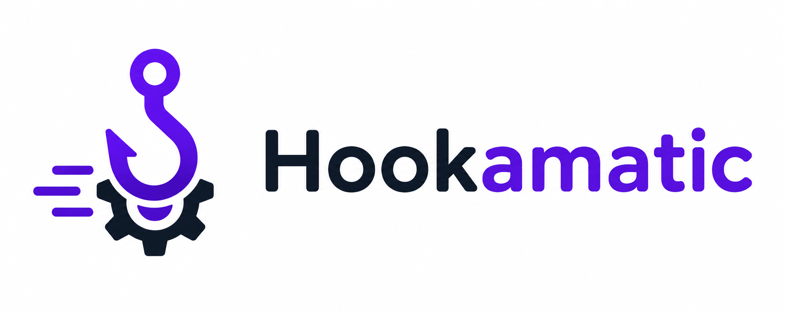

# Hookamatic



A customizable webhook manager for Laravel - dispatch signed outbound webhooks to subscribers, and receive/verify inbound webhooks from third parties, with retries, rate limiting, priority ordering, and multi-organization scoping built in.

## Requirements

- PHP 8.2+
- Laravel 11, 12, or 13 (`illuminate/support` `^11.3|^12.0|^13.0`)

## Installation

```bash
composer require vandmade/hookamatic
```

The service provider is auto-discovered - no manual registration needed. Publish the config file if you want to customize anything:

```bash
php artisan vendor:publish --tag=hookamatic-config
```

Then run the migrations:

```bash
php artisan migrate
```

## Quick start

### Outbound

Dispatch a named event with a payload - every `Subscriber` attached to that event type gets a signed delivery queued for it:

```php
use VanDmade\Hookamatic\Facades\Hookamatic;

Hookamatic::dispatch('order.shipped', [
    'order_id' => $order->id,
    'tracking_number' => $shipment->tracking_number,
]);
```

Dispatching only creates `Delivery` rows - schedule `DeliverWebhookJob` to actually send them:

```php
use VanDmade\Hookamatic\Jobs\DeliverWebhookJob;

$schedule->job(new DeliverWebhookJob())
    ->everyMinute()
    ->withoutOverlapping();
```

### Inbound

Wrap a route with the `hookamatic` middleware to receive, track, and verify inbound webhooks from a configured provider:

```php
Route::post('webhooks/stripe', [StripeWebhookController::class, 'handle'])
    ->middleware('hookamatic:stripe');
```

Verification, idempotency (duplicate deliveries from the provider are automatically deduplicated), and attempt tracking all happen before your controller runs.

## Features

- Outbound dispatch with per-subscriber HMAC (Hash-based messaging authentication code) signing, priority-ordered delivery, and rate limiting
- Exponential backoff retries, with automatic exhaustion after `max_delivery_attempts` and optional auto-disabling of misbehaving subscribers. Helps with potential load issues on the endpoint.
- Inbound webhook receiving via a single middleware, with pluggable per-provider verification (Stripe built in) and built-in idempotency
- A small CRUD API + Artisan commands for managing subscribers and event types
- Optional multi-organization/tenant scoping, added after the fact via `hookamatic:add-organization-scoping`
- `hookamatic:retry-failed-deliveries`, `hookamatic:outbound-stats`, and `hookamatic:inbound-stats` Artisan commands for day-to-day operations

## Documentation

| Doc | Covers |
|---|---|
| [Outbound Dispatching](docs/01-outbound-dispatching.md) | `Hookamatic::dispatch()`, `DeliverWebhookJob`, priority ordering, rate limiting, delivery lifecycle |
| [Subscribers & Event Types](docs/02-subscribers.md) | The `Subscriber`/`EventType` models, subscribing, disabling, the CRUD API |
| [Signing](docs/03-signing.md) | The outbound signature format and how to verify it |
| [Retries & Backoff](docs/04-retries-and-backoff.md) | The retry schedule, exhaustion, reviving failed deliveries |
| [Inbound Receiving](docs/05-inbound-receiving.md) | Wiring the `hookamatic` middleware onto a route, idempotency |
| [Inbound Verification](docs/06-inbound-verification.md) | Configuring providers, the built-in Stripe verifier, writing your own |
| [Inbound Processing](docs/07-inbound-processing.md) | What happens around your route handler, retry/give-up behavior |
| [Artisan Commands](docs/08-artisan-commands.md) | `hookamatic:retry-failed-deliveries`, `hookamatic:outbound-stats`, `hookamatic:inbound-stats`, `hookamatic:add-organization-scoping` |
| [Configuration](docs/09-configuration.md) | `config/hookamatic.php` reference |

## Testing

```bash
composer test
```

## License

Apache License 2.0 - see [LICENSE](LICENSE).
